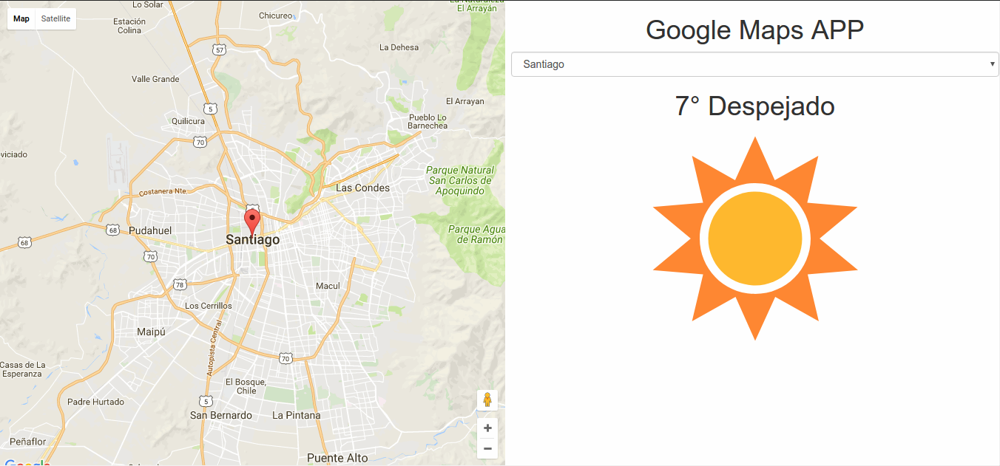

# Desafío Latam / Bootcamp Front-end
## Semana 9 - Actividad presencial 1.

##### El objetivo de esta actividad es la creación de un landing que permita seleccionar distintas ubicaciones. Por cada ubicación seleccionada debe conectarse con:
- La [API de Google Maps](https://developers.google.com/maps/documentation/javascript/tutorial?hl=es) para desplegar un mapa que muestre la ubicación seleccionada.
- La [API de DarkSky](https://darksky.net/dev/) para obtener un resumen del clima de la ubicación.

#### Actividad:

- Registrarse en el sitio web de la [API de Google](https://developers.google.com/maps/documentation/javascript/tutorial?hl=es) para obtener una API Key.

- Registrarse en el sitio web de la [API de DarkSky](https://darksky.net/dev/) para obtener una API Key.

- Crear una carpeta para el proyecto. Dentro de la carpeta crear el archivo index.html y app.js

- Abrir el archivo index.html, crear la estructura básica HTML, integrar jQuery mediante CDN e integrar el archivo app.js

- Consultar la documentación de ambas API para su implementación.

- El mapa de Google debe estar posicionado a la izquierda ocupando un 50% del ancho y un 100% de la altura del [viewport](https://web-design-weekly.com/2014/11/18/viewport-units-vw-vh-vmin-vmax/).

- A la derecha se debe implementar un Select que permita distintas ubicaciones del país. Las coordenadas de cada ubicación deben estar almacenadas en un objeto literal en el archivo app.js

- Al seleccionar una ubicación:

  - Mostrar el mapa centrado en la ubicación seleccionada con un marcador. Al seleccionar una nueva ubicación, el mapa debe ser re-centrado y se debe mostrar un nuevo marcador.(Hint: utilizar método [map.setCenter()](https://www.w3schools.com/graphics/google_maps_events.asp))

  - Consultar la API de DarkSky para obtener un resumen del clima de la ubicación seleccionada.

    

##### Observaciones generales:

  - Al instanciar un nuevo mapa, la propiedad 'center' recibe como argumento un objeto literal que debe tener la siguiente estructura (la misma para el método setCenter()):

    ~~~js
    santiago_coords: {
 		lat: -33.4488897,
 		lng: -70.6692655
 	  };
    ~~~

  - Los métodos de Google Map manejan las ubicaciones como un objeto literal, sin embargo, la API de DarkSky recibe los parámetros en la url como string.

  - En caso de obtener error __No 'Access-Control-Allow-Origin' header is present on the requested resource.__ En el llamado a la API de DarkSky, se debe anteponer un proxy a la url, por ejemplo:

  ~~~
  https://crossorigin.me/https://api.darksky.net/forecast/....
  ~~~
